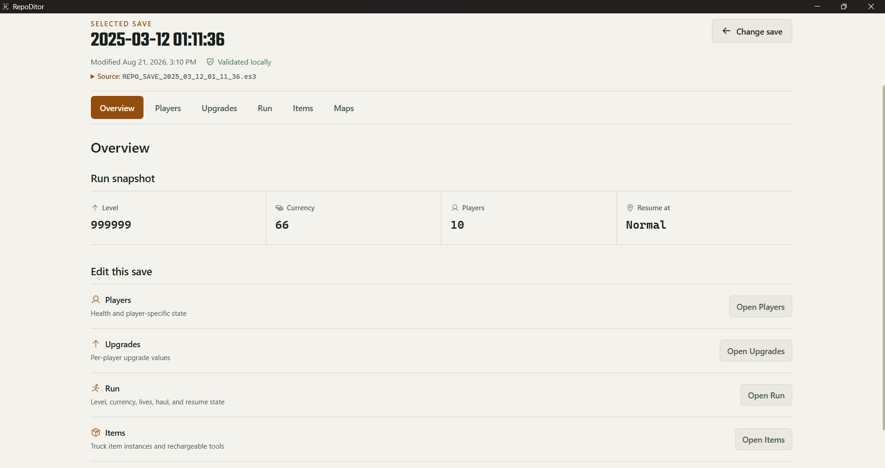
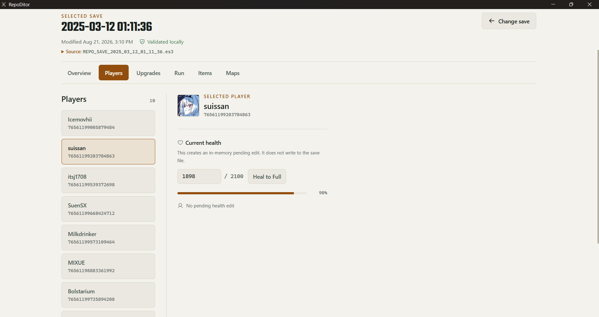
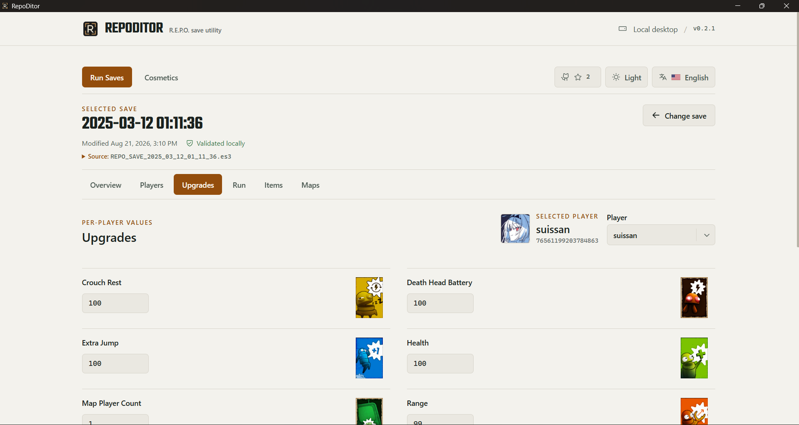
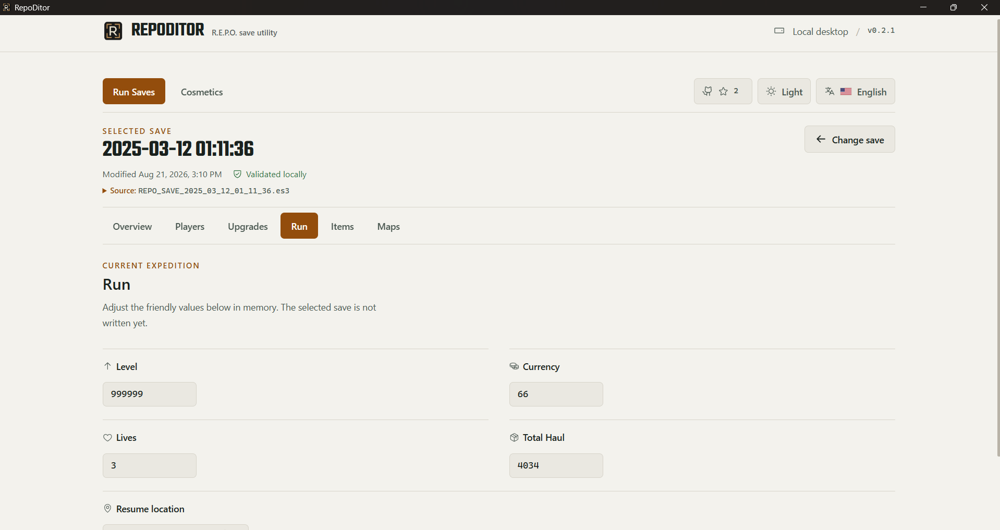
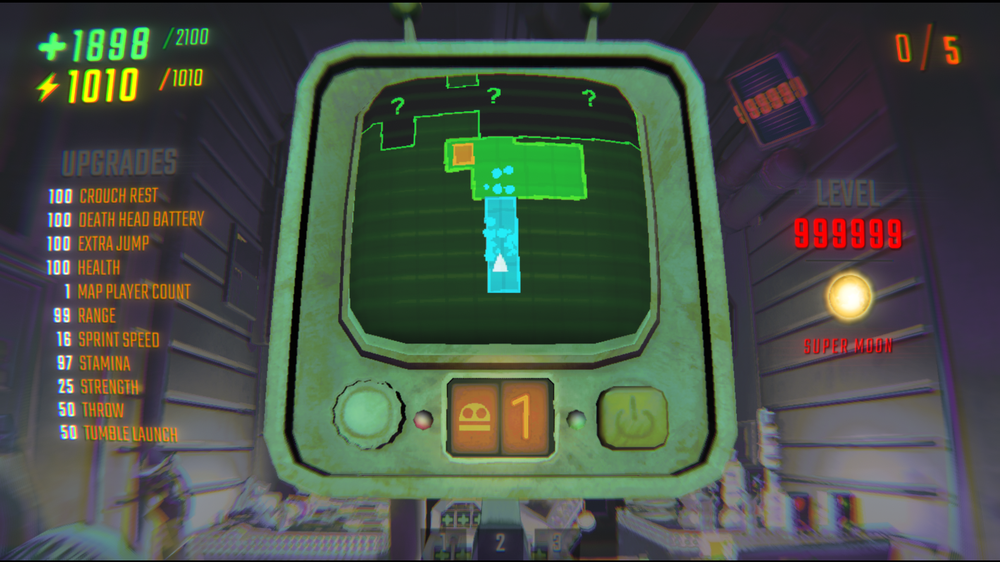

<p align="center">
  
  
  
  
  
  
  
</p>

<div align="center">

# RepoDitor

### Periksa dan edit save R.E.P.O. lokal dari aplikasi desktop Windows yang fokus — tanpa perlu BepInEx

RepoDitor adalah save editor Electron mandiri dan tidak resmi untuk data `.es3` R.E.P.O. lokal.

Antarmuka desktop hanya menyediakan operasi bertipe dengan cakupan yang jelas, sementara backend Python yang dibundel menangani parsing save, validasi, backup, semantik game, dan penulisan terenkripsi.

RepoDitor berjalan terpisah dari game dan tidak memerlukan BepInEx, mod loader, atau instalasi ke direktori game R.E.P.O.

<sub>Ringkasan · Pemain · Peningkatan · Permainan · Item · Kosmetik · Peta</sub>

[Unduh release terbaru](https://github.com/Yoruxyv/RepoDitor/releases/latest)

</div>

<p align="center">
  <a href="README.md">
    
  </a>
  <a href="README.zh-CN.md">
    
  </a>
  <a href="README.id.md">
    
  </a>
</p>

---

> [!IMPORTANT]
> Tutup R.E.P.O. sebelum membuka atau mengedit save. RepoDitor adalah tool komunitas
> tidak resmi dan tidak berafiliasi dengan semiwork. Sebaiknya backup data penting;
> update game dapat mengubah format atau perilaku save.

## ✨ Fitur

### Save Run

| Ruang kerja | Dukungan saat ini |
|---|---|
| **Ringkasan** | Tinjau run yang dipilih, ringkasannya, dan perubahan tertunda |
| **Pemain** | Edit kesehatan saat ini, pulihkan hingga maksimum yang dihitung Python, dan tampilkan avatar Steam secara opsional |
| **Peningkatan** | Edit upgrade yang ditemukan secara dinamis dari save, dengan metadata instalasi dan gambar tambahan jika tersedia |
| **Permainan** | Edit nilai run yang didukung melalui field bertipe dan tervalidasi |
| **Item** | Cari, filter, dan urutkan instance yang ditemukan; siapkan **Isi Ulang** hingga penuh hanya jika metadata instalasi memastikan tipe item dapat diisi ulang dan instance tersebut memang memiliki daya tersimpan |
| **Peta** | Daftar map yang terpasang secara lokal tanpa menyuntikkan kode atau memaksa pemilihan map |

### Kosmetik / MetaSave

Kosmetik memiliki ruang kerja dan lifecycle penulisan aman sendiri, terpisah dari
save Run yang dipilih. Jika metadata instalasi yang kompatibel tersedia,
RepoDitor menampilkan nama tampilan milik game, tipe, nilai kelangkaan, ikon lokal
opsional, total kepemilikan, dan jumlah preset tersimpan. Katalog mendukung
pencarian, filter kepemilikan/tipe, dan pengurutan tanpa menjadikan metadata
presentasi sebagai dasar untuk menentukan apa yang boleh dimutasi.

Tindakan yang didukung saat ini:

- buka satu kosmetik terkunci yang memenuhi syarat, atau **Buka Semua Kosmetik**;
- **Kunci Semua Kosmetik**, hanya jika tidak ada kosmetik yang diketahui dimiliki
  sedang dipakai, direferensikan oleh preset, atau tidak aman untuk dihapus karena
  alasan lain;
- **Hapus Semua Preset**, yang mengosongkan slot preset kosmetik/warna yang berpasangan.

Kelayakan mutasi tetap dibatasi pada ID terpasang di dalam batas `0..546` yang
telah dibuktikan secara independen. ID kosmetik yang tidak dikenal atau muncul
di versi mendatang tetap dipertahankan sebagai hanya-baca. Pengeditan token,
equipment/warna secara bebas, serta pembuatan atau pengeditan preset secara
bebas belum didukung karena semantik gamenya belum ditetapkan dengan cukup aman.

## 🖼️ Preview

| Ringkasan save Run | Katalog kosmetik |
|---|---|
|  |  |

| Editor Pemain | Upgrade Pemain |
|---|---|
|  |  |

| Editor Permainan | Isi Ulang Item Truk |
|---|---|
|  |  |

### Pemeriksaan kompatibilitas manual di dalam game



Gambar menunjukkan sebuah run R.E.P.O. dengan level yang dibuat sangat tinggi,
serta nilai upgrade, kesehatan, energi, dan daya item yang diedit. Perubahan
RepoDitor diterapkan ke file save lokal; game akan membacanya pada pemuatan berikutnya.

## 🚀 Mulai Cepat

### Persyaratan

- Windows x64
- instalasi dan save R.E.P.O. lokal

### Instalasi

1. Buka [halaman resmi GitHub Releases](https://github.com/Yoruxyv/RepoDitor/releases/latest).
2. Unduh `RepoDitor-Setup-<version>-x64.exe` beserta file `.sha256`-nya.
3. Verifikasi checksum seperti dijelaskan di bawah, lalu jalankan installer dengan wizard.

Aplikasi yang terpasang sudah menyertakan backend Python. Python, Node.js, npm,
dan `uv` tidak diperlukan untuk penggunaan normal.

RepoDitor menemukan file `REPO_SAVE_*.es3` di bawah direktori save R.E.P.O.
milik akun Windows yang sedang digunakan. File yang mengandung `BACKUP`
dikecualikan dari penemuan otomatis.

Update dilakukan secara manual; RepoDitor tidak memasang updater atau service
latar belakang. Uninstall melalui
**Windows Settings → Apps → Installed apps → RepoDitor**.
Menghapus RepoDitor tidak menghapus save R.E.P.O. atau backup `.bak-*` yang
dibuat RepoDitor.

## 🛡️ Keamanan Save

R.E.P.O. dapat mempertahankan status save di memori lalu menuliskannya ke disk
belakangan. Karena itu, mengedit saat game masih berjalan dapat membuat RepoDitor
menggunakan data persisten yang sudah tidak terbaru, atau perubahan RepoDitor
dapat ditimpa oleh save game berikutnya. Pemeriksaan saat startup dan ketika
window kembali mendapatkan fokus menjaga antarmuka tetap mengikuti keadaan
terbaru. Secara terpisah, batas penulisan Python mewajibkan game dipastikan sudah
tertutup sebelum sumber dimuat dan sekali lagi tepat sebelum data dipersistenkan.
Jika status proses tidak dapat dipastikan, operasi akan gagal secara aman dan
penulisan tidak dilanjutkan.

Pipeline penulisannya:

1. Edit tetap berada di memori sampai **Simpan Perubahan** dikonfirmasi.
2. Python memuat dan memvalidasi sumber saat ini, lalu membandingkan SHA-256-nya
   dengan fingerprint yang diambil saat save dibuka.
3. Perubahan bertipe divalidasi dan diterapkan di memori, lalu pemeriksaan proses
   game kedua dilakukan.
4. Repository membaca ulang sumber, mewajibkan kecocokan byte yang persis, lalu
   membuat backup byte-for-byte dengan timestamp di sebelah file sumber.
5. Output terenkripsi ditulis ke staging, dibuka kembali, didekripsi, divalidasi,
   dan dibandingkan dengan data yang dimaksud.
6. Sumber diperiksa sekali lagi sebelum file staging menggantikannya secara atomik.

Perlindungan ini mengurangi risiko, tetapi bukan jaminan terhadap perubahan
format game di masa depan atau semua bentuk kehilangan data.

## ✅ Memverifikasi Download Windows

Windows SmartScreen dapat menampilkan **Unknown Publisher** atau peringatan
aplikasi tidak dikenal untuk build yang tidak ditandatangani atau reputasinya
masih rendah. Unduh hanya dari halaman resmi GitHub Releases RepoDitor.
Source dan workflow build tersedia secara publik, dan installer yang
dipublikasikan menyertakan file checksum SHA-256.

Di PowerShell, tempatkan kedua file dalam direktori yang sama lalu jalankan:

```powershell
Get-FileHash .\RepoDitor-Setup-<version>-x64.exe -Algorithm SHA256
Get-Content .\RepoDitor-Setup-<version>-x64.exe.sha256
```

Hash heksadesimalnya harus sama persis, dengan kapitalisasi huruf diabaikan.
Checksum yang cocok memastikan file tersebut sama dengan artifact yang
dipublikasikan; checksum saja tidak membuktikan identitas publisher. Installer
v0.1.0 historis tidak ditandatangani. Workflow release saat ini sudah disiapkan
untuk mewajibkan Microsoft cloud signing pada build resmi bertag, tetapi
repository tidak dapat membuktikan apakah kredensial signing milik maintainer
sudah dikonfigurasi.

## 🔐 Model Keamanan

Renderer berjalan dalam sandbox dengan `contextIsolation: true` dan
`nodeIntegration: false`. Renderer tidak dapat membaca file sembarang,
menjalankan proses, mendekripsi save, memanggil IPC sembarang, atau menerima
JSON save mentah yang sudah didekripsi.

Pengayaan avatar Steam bersifat opsional dan fail-soft. Hanya Steam ID yang
masuk akal yang akan diminta; URL gambar yang dikembalikan divalidasi terhadap
daftar host HTTPS yang sempit, dan data profile tidak pernah ditulis ke save.
Jumlah bintang GitHub menggunakan satu endpoint metadata tetap melalui Electron
IPC yang bertipe, dengan cache session untuk hasil yang berhasil; renderer tidak
mendapat API network-fetch arbitrer.

Itulah network request latar belakang opsional yang ada saat ini. Link proyek
hanya dibuka secara eksternal setelah tindakan pengguna, dan source saat ini
tidak memiliki integrasi analytics atau telemetry.

Lihat [SECURITY.md](SECURITY.md) untuk melaporkan kerentanan secara privat.

## 🔎 Open Source & Data Lokal

RepoDitor adalah open source. Aplikasi desktop Electron, backend save Python,
konfigurasi packaging, serta workflow CI/release tersedia di repository ini
untuk diperiksa, dan proyek dapat di-build dari source dengan perintah development
dan packaging yang didokumentasikan. Source yang tersedia publik tidak dengan
sendirinya membuktikan bahwa binary yang diunduh identik dengannya; checksum
yang dipublikasikan memverifikasi integritas artifact, bukan keamanan kode atau
identitas publisher.

Parsing, validasi, dan pengeditan save berjalan secara lokal di backend Python
yang dibundel. JSON save mentah yang sudah didekripsi tetap berada di balik
batas desktop Python dan tidak diekspos ke React maupun diunggah ke layanan
pemrosesan save jarak jauh. Aplikasi membaca lokasi tetap untuk save R.E.P.O.
dan MetaSave, metadata instalasi Steam, file data game terpasang yang didukung,
serta cache ikon yang dihasilkan oleh R.E.P.O. Aplikasi hanya menulis save
setelah tindakan simpan yang didukung dilakukan secara eksplisit, membuat backup
dan file staging sementara di sebelah sumber tersebut, lalu menyimpan preferensi
renderer beserta cache presentasi/katalog turunan di data aplikasi milik RepoDitor.

Dua fitur opsional menggunakan network request dengan cakupan sempit:
metadata proyek GitHub dibaca dari endpoint repository RepoDitor yang tetap,
sedangkan pengayaan avatar Steam mengirim Steam ID yang masuk akal dan berasal
dari save ke endpoint profile Steam publik yang sesuai, lalu hanya menerima
avatar dari host HTTPS yang masuk allowlist. Tidak satu pun request tersebut
menerima file save atau data save mentah yang sudah didekripsi. Source aplikasi
dan dependency saat ini tidak memiliki analytics, SDK iklan, telemetry penggunaan,
upload laporan crash, atau integrasi remote logging.

## 💾 Kesegaran Save & Cache Presentasi

Sumber data otoritatif untuk save dan cache presentasi sengaja dipisahkan:

| Data | Perilaku saat ini |
|---|---|
| **Status save** | Setiap kali save dibuka secara eksplisit, Python diminta membaca, mendekripsi, dan memvalidasi `.es3` saat ini, lalu hanya mengembalikan proyeksi bertipe dan fingerprint sumber. JSON save yang telah didekripsi tidak dipersistenkan. Renderer hanya boleh memakai kembali data entri editor yang bertipe selama session aplikasi saat ini setelah pembukaan lain memastikan fingerprint yang sama; penulisan yang berhasil membatalkan entri tersebut. |
| **Ikon item/kosmetik yang dihasilkan game** | PNG tetap berada di cache ikon LocalLow milik R.E.P.O. Electron menyajikan file yang sudah divalidasi melalui token dalam memori yang opaque; path dan nama file cache tidak diteruskan ke React. |
| **Gambar upgrade turunan** | Python mencari dan mendekode texture yang didukung dari game yang terpasang. Electron menyimpan PNG turunan yang telah divalidasi di `%APPDATA%\repoditor-desktop\presentation`, menggunakannya kembali hanya selama identitas sumber yang diawasi tidak berubah, membersihkan PNG turunan yang tidak lagi direferensikan, lalu membuat ulang atau fallback ke Phosphor jika sebuah entri hilang, berubah, malformed, atau tidak dapat dibaca. |
| **Metadata kosmetik terpasang** | Cache katalog turunan di `%LOCALAPPDATA%\RepoDitor\cache\cosmetics` hanya diterima jika schema, Steam build, game root, dan identitas file terpasang yang relevan masih cocok. Cache ini hanya menyediakan data presentasi, bukan bukti kepemilikan atau otoritas mutasi. |

Preferensi tema dan bahasa menggunakan storage renderer. RepoDitor hanya menulis
data R.E.P.O. setelah tindakan simpan yang didukung dilakukan secara eksplisit;
backup dibuat di sebelah sumber, bukan di dalam cache presentasi.

Untuk mengaudit cache presentasi turunan setelah RepoDitor di-restart, jalankan:

```powershell
.\desktop\scripts\check-presentation-cache.ps1
```

Script read-only ini membandingkan `manifest.json` dengan PNG bernama hash yang
tersimpan dan melaporkan artifact yang tidak direferensikan atau hilang.

## 🌐 Bahasa & Tampilan

RepoDitor mendukung tema **Gelap**, **Terang**, dan **Sistem**. Preferensi tema
dan bahasa disimpan secara lokal di renderer, dan Sistem mengikuti pengaturan
tampilan Windows.

Antarmuka milik RepoDitor tersedia dalam:

- English
- Japanese (日本語)
- Korean (한국어)
- Simplified Chinese (中文)
- Indonesian (Bahasa Indonesia)

Terjemahan Jepang dan Korea pada awalnya dibuat dengan bantuan AI dan belum
mendapat review lengkap dari penutur native/fasih. Koreksi dari penutur yang
fasih dan native sangat diterima.

String yang berasal dari game—seperti nama pemain, nama item, nama map, dan
nilai yang dibaca dari save—tetap apa adanya dan tidak diterjemahkan oleh layer
lokalisasi UI RepoDitor. Antarmuka juga menghormati preferensi reduced motion;
suara interaksi lokal hanya bersifat dekoratif dan tidak diperlukan untuk
memahami status aplikasi.

## 🧠 Cara Kerja

```text
React renderer
  ↓ typed feature calls
Sandboxed Electron preload
  ↓ narrow IPC contracts
Electron main process
  ↓ structured requests
Bundled Python desktop API
  ↓
Services → core/storage → encrypted .es3 data
```

Save Run dan MetaSave menggunakan fingerprint, perubahan tertunda, backup,
dan session save masing-masing secara independen sambil memakai repository
terenkripsi tervalidasi yang sama. Python tetap menjadi sumber otoritatif untuk
semantik game dan save.

Penemuan save dan konten terpasang dilakukan secara dinamis jika struktur yang
sudah diverifikasi mendukungnya. Reader game terpasang yang spesifik terhadap
build menggunakan compatibility gate yang eksplisit; jika ada ketidakpastian,
presentasi atau kemampuan akan turun menjadi tidak tersedia/tidak diketahui,
bukan memperluas apa yang boleh dimutasi. Lihat
[architecture](docs/architecture/architecture.md) dan
[catatan reverse engineering](docs/research/reverse-engineering.md) untuk batas
yang lebih mendalam.

## 🧪 Kualitas & Pengujian

Test otomatis menggunakan fixture yang dibuat atau disanitasi serta salinan
sementara, bukan save pengguna asli. Repository memeriksa formatting/test Python,
batas import renderer, lint, build TypeScript, test component/contract,
Windows Electron E2E, isi package, packaged E2E tanpa Vite, dan struktur installer.

```powershell
uv run ruff check python tests
uv run ruff format --check python tests
uv run mypy
uv run --locked --no-dev --group test pytest

Set-Location desktop
npm run imports:check
npm run format:check
npm run lint
npm run release:check
npm run build
npm run bundle:check
npm test
npm run test:e2e
```

## 🛠️ Development

Development memerlukan `uv`, Python 3.11 atau lebih baru, dan Node.js 24.

```powershell
git clone https://github.com/Yoruxyv/RepoDitor.git
Set-Location RepoDitor
uv sync --locked

Set-Location desktop
npm ci
npm run dev
```

Lihat [CONTRIBUTING.md](CONTRIBUTING.md) untuk aturan arsitektur, evidence,
privasi, dan pull request.

## 📦 Packaging & Release

Dari `desktop/`, `npm run package` membangun sidecar Python 3.13 PyInstaller
**onedir** dengan dependency terkunci, aplikasi Electron production,
unpacked packaged smoke test, installer NSIS dengan wizard, serta verifikasi
artifact lokal di `desktop/release/`. Electron Builder memasang direktori
sidecar di `resources/backend/` sambil mempertahankan entry point tetap
`resources/backend/repoditor-backend.exe`. Jalur build lokal ini memang sengaja
tidak ditandatangani.

Release GitHub resmi bertag menggunakan perintah signing fail-closed yang
terpisah, memverifikasi signature Authenticode sebelum membuat file SHA-256,
dan baru dipublikasikan setelah pemeriksaan package yang sudah ada berhasil.
Workflow manual sementara yang terpisah dapat mempublikasikan release unsigned
dengan label yang jelas jika approval signing atau kredensial belum tersedia;
workflow tersebut tetap mempertahankan gate quality, package, packaged-E2E,
installer, dan checksum, tetapi melewati verifikasi signature. Lihat
[release checklist](docs/release-checklist.md) untuk persyaratan saat ini dan
baseline historis v0.1.0 yang dipertahankan.

## ⚠️ Batasan

- RepoDitor menargetkan struktur save terenkripsi R.E.P.O. yang sudah diamati;
  update game dapat memperkenalkan data yang tidak kompatibel.
- Item hanya mendukung **Isi Ulang** hingga penuh pada instance yang tepat setelah
  kemampuan tipe item berdasarkan instalasi dan bukti daya tersimpan sama-sama
  sesuai. Pengeditan angka daya, penulisan battery upgrade, mutasi pembelian,
  serta menambah/menghapus/menduplikasi item tetap dinonaktifkan.
- Kosmetik mendukung pembukaan satu item yang memenuhi syarat, pembukaan massal,
  penguncian massal dengan guard, dan pengosongan preset berpasangan. Equipment,
  token, warna bebas, serta pembuatan/pengeditan preset bebas tetap tidak didukung;
  ID di luar batas mutasi yang telah dibuktikan dipertahankan sebagai hanya-baca.
- Peta hanya untuk discovery; RepoDitor tidak menyuntikkan kode atau memaksa
  pemilihan map.
- Pengayaan avatar Steam dapat tidak tersedia untuk profile yang invalid, private,
  malformed, tidak dapat dijangkau, atau tidak didukung tanpa memblokir Pemain.
- Kemampuan isi ulang item dan gambar upgrade hasil decode menggunakan
  compatibility gate untuk layout game terpasang yang telah divalidasi. Update
  game dapat membuat kemampuan tersebut menjadi tidak diketahui atau gambar
  menjadi tidak tersedia, sementara pembacaan save biasa yang didukung tetap
  dapat digunakan.
- RepoDitor saat ini menargetkan Windows x64 dan tidak memiliki updater otomatis.

## 📚 Dokumentasi

| Dokumen | Kegunaan |
|---|---|
| [Indeks dokumentasi](docs/README.md) | Titik masuk terorganisir untuk dokumentasi teknis dan release |
| [Arsitektur](docs/architecture/architecture.md) | Batas desktop, kepemilikan, dan alur data |
| [Electron UI](docs/architecture/electron-ui.md) | Identitas renderer, responsivitas, tampilan, dan aksesibilitas |
| [Format save](docs/research/save-format.md) | Struktur save terenkripsi yang telah dikonfirmasi |
| [Reverse engineering](docs/research/reverse-engineering.md) | Evidence historis, dukungan saat ini, dan semantik yang belum terselesaikan |
| [Release checklist](docs/release-checklist.md) | Gate release saat ini dan baseline historis v0.1.0 |
| [Riset aset](docs/research/asset-research.md) | Evidence penemuan aset lokal dan batas redistribusi |
| [Third-party notices](THIRD_PARTY_NOTICES.md) | Atribusi aset dan dependency yang dibundel |

## 🤝 Berkontribusi

Laporan bug yang fokus, proposal fitur, perbaikan dokumentasi, dan pull request
sangat diterima. Gunakan template repository dan jangan pernah mempublikasikan
file save asli, backup, Steam ID, username, atau path filesystem lokal.

Baca [CONTRIBUTING.md](CONTRIBUTING.md), [SECURITY.md](SECURITY.md), dan
[Code of Conduct](CODE_OF_CONDUCT.md) sebelum berkontribusi.

## 👤 Maintainer

<table>
  <tr>
    <td align="center" width="180">
      <a href="https://github.com/Yoruxyv">
        <br>
        <b>Hans</b>
      </a>
    </td>
  </tr>
</table>

## 📄 Lisensi

RepoDitor dirilis di bawah [MIT License](LICENSE). R.E.P.O. dan nama terkait
merupakan merek dagang atau properti milik pemiliknya masing-masing. RepoDitor
adalah utilitas pengelolaan save tidak resmi dan tidak mendistribusikan ulang
aset game R.E.P.O.
