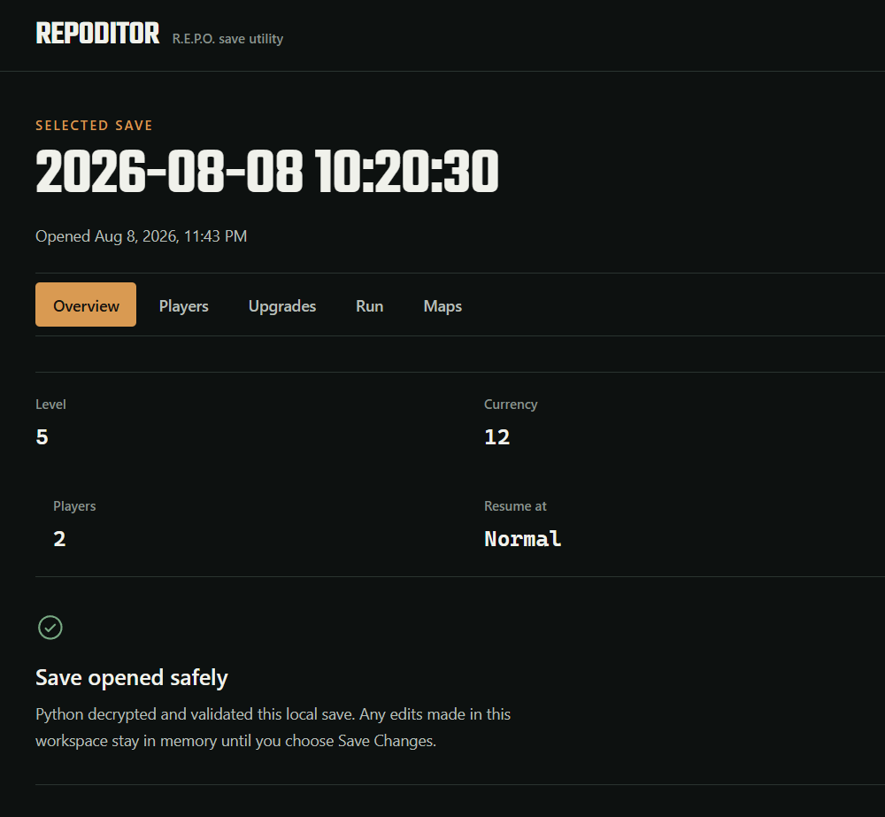

# RepoDitor

RepoDitor is an unofficial Electron desktop editor for local **R.E.P.O.** `.es3` run saves. Save encryption, validation, game semantics, backups, and writes remain in the bundled Python backend.

## Current features

- discover the default Windows R.E.P.O. save directory and recent saves;
- inspect Overview, Players, Upgrades, Run, and installed Maps data;
- edit current health, detected player upgrades, and supported run fields in memory;
- review and revert pending edits before saving;
- validate the source fingerprint before every write;
- create a timestamped backup and atomically replace the selected save;
- enrich valid Steam players with optional, fail-soft avatars.

> [!IMPORTANT]
> RepoDitor is an unofficial community tool and is not affiliated with semiwork. Back up important saves before editing them. Game updates can change save behavior or schema.

## Preview



## Install

Download `RepoDitor-<version>-x64.zip` from the project releases, extract it, and run `RepoDitor.exe`. The archive includes Electron and the Python backend; users do not need Python, `uv`, Node.js, or npm.

Current builds are unsigned, so Windows SmartScreen may ask for confirmation. Each release also includes a SHA-256 checksum beside the archive.

Updates are manual: download and extract a newer GitHub Release archive when one is published. RepoDitor does not include an auto-updater or a background update service.

## Development setup

Development requires `uv`, Python 3.11 or newer, and Node.js 24.

```powershell
uv sync --locked

cd desktop
npm ci
npm run dev
```

The Python desktop protocol can also be exercised directly:

```powershell
uv run python -m repo_save_editor.desktop_api environment
```

## Quality checks

```powershell
uv run ruff check python tests
uv run ruff format --check python tests
uv run --with "pytest>=8.3,<9" pytest

cd desktop
npm run imports:check
npm run lint
npm run release:check
npm run build
npm run bundle:check
npm test
npm run test:e2e
```

Python tests use temporary directories and generated encrypted fixtures. Electron E2E creates an isolated fake Windows profile, verifies backups and stale-file protection, and never targets real user saves.

## Windows packaging

From `desktop/`, run:

```powershell
npm run package
```

This builds the locked Python 3.13 PyInstaller sidecar, builds Electron, runs the full E2E flow against the unpacked production application, and creates the self-contained Windows archive under `desktop/release/`.

The release workflow accepts semantic tags matching the project version, such as `v0.1.0`. It reruns the required quality checks, packaged smoke test, archive build, and checksum generation before publishing. See [`docs/release-checklist.md`](docs/release-checklist.md) for the release gate.

## Default save location

RepoDitor scans recursively under `%USERPROFILE%\AppData\LocalLow\semiwork\Repo` for `REPO_SAVE_*.es3`. Files containing `BACKUP` are excluded from discovery.

## Architecture

```text
React renderer
  -> sandboxed Electron preload
  -> Electron main IPC
  -> Python desktop API sidecar
  -> services
  -> core + storage
  -> encrypted .es3 files
```

The renderer never receives raw decrypted save JSON and cannot access the filesystem or spawn processes. Development uses the repository `.venv`; packaged builds resolve only the sidecar under Electron's resources directory.

See [`docs/architecture.md`](docs/architecture.md) for boundary and migration decisions.

## Safety behavior

RepoDitor validates pending edits and detects stale source files before mutation. A successful save first creates a sibling backup such as `REPO_SAVE_2025_11_04_20_53_58.es3.bak-20260807-120000`, writes and validates a temporary encrypted file, then atomically replaces the target.

## Compatibility

RepoDitor targets the observed AES-encrypted ES3 payload used by R.E.P.O. run saves. Unsupported or malformed saves are rejected before mutation.

## Fonts and license

The desktop package bundles Teko under the SIL Open Font License. Body text uses the Windows Segoe UI stack, so release builds do not depend on a font CDN or network connection.

RepoDitor is released under the [MIT License](LICENSE). R.E.P.O. and related names are trademarks/property of their respective owners. RepoDitor is an unofficial save-management utility and contains no game assets.
