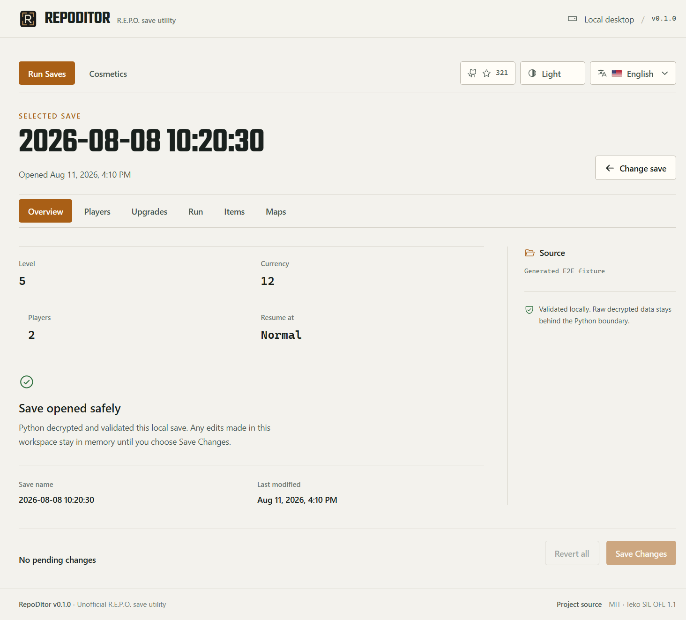
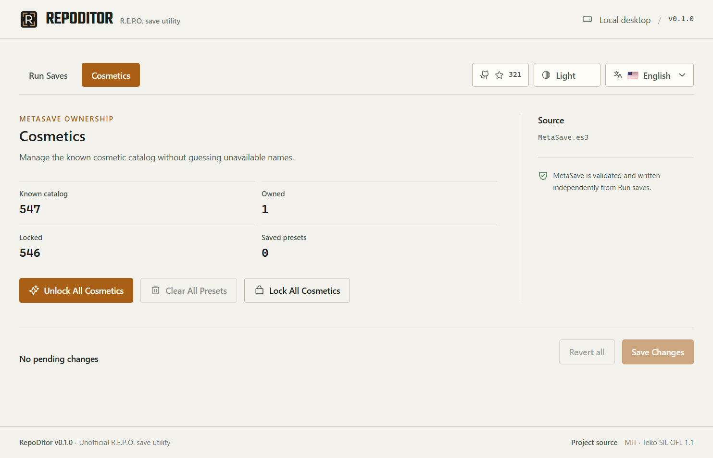
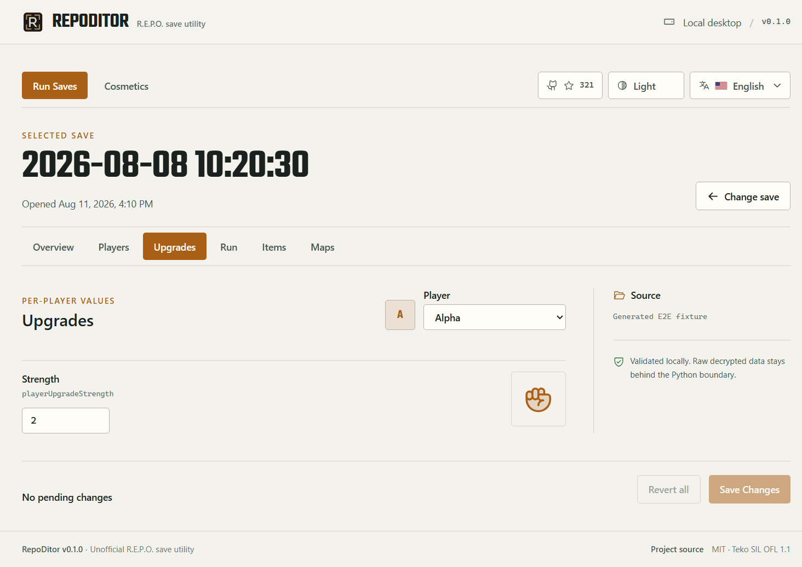
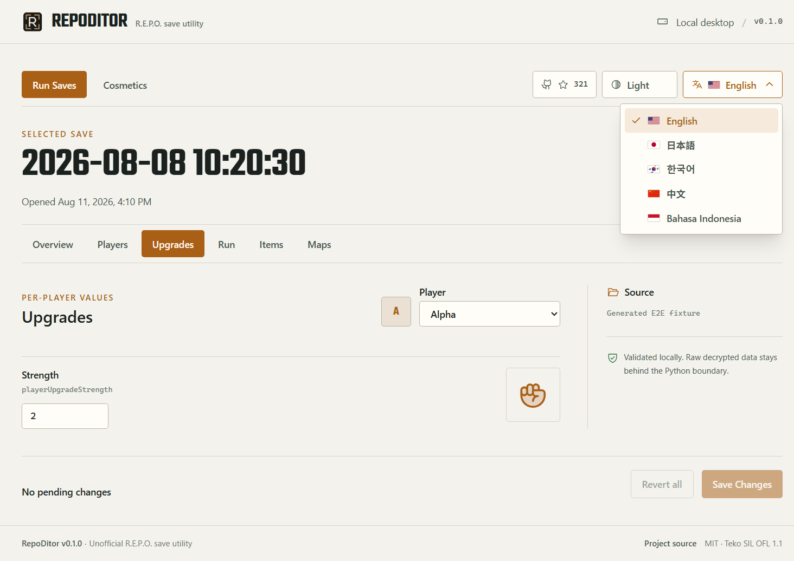

<p align="center">
  
  
  
  
  
  
  
</p>

<div align="center">

# RepoDitor

### Inspect and safely edit local R.E.P.O. saves from a focused Windows desktop app

RepoDitor is an unofficial Electron editor for local R.E.P.O. `.es3` data.
The interface uses narrow typed operations while a bundled Python backend owns
save parsing, validation, backups, game semantics, and encrypted writes.

<sub>Overview · Players · Upgrades · Run · Items · Cosmetics · Maps</sub>

[Download the latest release](https://github.com/Yoruxyv/RepoDitor/releases/latest)

</div>

---

> [!IMPORTANT]
> Close R.E.P.O. before opening or editing saves. RepoDitor is an unofficial
> community tool and is not affiliated with semiwork. Back up important data;
> game updates can change the save format or behavior.

## ✨ Features

### Run Saves

| Workspace | Current support |
|---|---|
| **Overview** | Review the selected run, its summary, and pending changes |
| **Players** | Edit current health, heal to the Python-calculated maximum, and show optional Steam avatars |
| **Upgrades** | Edit upgrades discovered dynamically from the save rather than a hardcoded catalog |
| **Run** | Edit supported run values through typed, validated fields |
| **Items** | Inspect item instances and use **Refill to Full** only when an exact stored-charge entry exists |
| **Maps** | List locally installed maps without injecting code or forcing a map selection |

### Cosmetics / MetaSave

Cosmetics has its own workspace and safe-write lifecycle, independent from a
selected Run save. It shows the known `0..546` catalog, owned/locked totals, and
saved-preset count. The current bulk actions are:

- **Unlock All Cosmetics**;
- **Lock All Cosmetics**, only when no known owned cosmetic is equipped,
  preset-referenced, or otherwise unsafe to remove;
- **Clear All Presets**, which clears the paired cosmetic/color preset slots.

Unknown and future cosmetic IDs are preserved. Individual per-ID controls,
cosmetic names, token editing, arbitrary equipment editing, and arbitrary
preset creation/editing are not supported because their game semantics have
not been established safely.

## 🖼️ Preview

The screenshots below use generated test data; no personal save paths, Steam
identifiers, or real user saves are included.

| Run Saves | Cosmetics |
|---|---|
|  |  |

| Selected player | Appearance and language |
|---|---|
|  |  |

## 🚀 Quick Start

### Requirements

- Windows x64
- a local R.E.P.O. installation and save

### Install

1. Open the [official GitHub Releases page](https://github.com/Yoruxyv/RepoDitor/releases/latest).
2. Download `RepoDitor-Setup-<version>-x64.exe` and its `.sha256` file.
3. Verify the checksum as described below, then run the assisted installer.

The installed app includes its Python backend. Python, Node.js, npm, and `uv`
are not required for normal use.

RepoDitor discovers `REPO_SAVE_*.es3` files below the current Windows account's
R.E.P.O. save directory. Files containing `BACKUP` are excluded from automatic
discovery.

Updates are manual; RepoDitor installs no updater or background service.
Uninstall through **Windows Settings → Apps → Installed apps → RepoDitor**.
Uninstalling does not delete R.E.P.O. saves or RepoDitor-created `.bak-*`
backups.

## 🛡️ Save Safety

R.E.P.O. can retain save state in memory and write it later. Editing the file
while the game is running could therefore use stale persisted data or be
overwritten by a later game save. RepoDitor checks the validated R.E.P.O.
process at startup, on window focus, and immediately before writes. It blocks
editing while the game is running and fails closed when process status cannot
be verified safely.

That check is additive to the write pipeline:

- edits stay in memory until **Save Changes** is confirmed;
- the source SHA-256 fingerprint is checked before mutation and again while staging;
- a timestamped exact-byte backup is created beside the source;
- Python validates the supported schema and change semantics;
- encrypted output is staged, reopened, and compared with the intended data;
- only verified output atomically replaces the source.

These safeguards reduce risk; they are not a guarantee against future game
format changes or every form of data loss.

## ✅ Verifying a Windows Download

Windows SmartScreen may show **Unknown Publisher** or an unrecognized-app
warning for an unsigned or low-reputation build. Download only from RepoDitor's
official GitHub Releases page. The source and build workflows are public, and
published installers include a SHA-256 checksum file.

In PowerShell, place both files in the same directory and run:

```powershell
Get-FileHash .\RepoDitor-Setup-<version>-x64.exe -Algorithm SHA256
Get-Content .\RepoDitor-Setup-<version>-x64.exe.sha256
```

The hexadecimal hashes must match exactly, ignoring letter case. A matching
checksum confirms the file matches the published artifact; it does not by
itself establish publisher identity. Historical v0.1.0 installers were
unsigned. The current release workflow is prepared to require Microsoft cloud
signing for official tagged builds, but the repository cannot prove whether
maintainer-owned signing credentials have been configured.

## 🔐 Security Model

The renderer is sandboxed with `contextIsolation: true` and
`nodeIntegration: false`. It cannot read arbitrary files, spawn processes,
decrypt saves, invoke arbitrary IPC, or receive raw decrypted save JSON.

Steam avatar enrichment is optional and fail-soft. Only plausible Steam IDs
are queried, returned image URLs are validated against narrow HTTPS hosts, and
profile data is never written into a save. GitHub stars use one fixed metadata
endpoint through typed Electron IPC with a successful-result session cache;
the renderer receives no arbitrary network-fetch API.

See [SECURITY.md](SECURITY.md) to report a vulnerability privately.

## 🌐 Languages & Appearance

RepoDitor supports **Dark**, **Light**, and **System** themes. Theme and language
preferences are stored locally in the renderer, and System follows the Windows
appearance setting.

The RepoDitor-owned interface is available in:

- English
- Japanese (日本語)
- Korean (한국어)
- Chinese (中文)
- Indonesian (Bahasa Indonesia)

Game-owned strings—such as player names, item names, map names, and values read
from saves—remain unchanged. The interface also respects reduced-motion
preferences; its local interaction sound is decorative and not required to
understand application state.

## 🧠 How It Works

```text
React renderer
  ↓ typed feature calls
Sandboxed Electron preload
  ↓ narrow IPC contracts
Electron main process
  ↓ structured requests
Bundled Python desktop API
  ↓
Services → core/storage → encrypted .es3 data
```

Run saves and MetaSave use independent fingerprints, pending changes, backups,
and save sessions while reusing the same validated encrypted repository.
Python remains authoritative for game and save semantics.

## 🧪 Quality & Testing

Automated tests use generated or sanitized fixtures and temporary copies, never
real user saves. The repository checks Python formatting/tests, renderer import
boundaries, lint, TypeScript builds, component/contract tests, Windows Electron
E2E, package contents, packaged E2E without Vite, and installer structure.

```powershell
uv run ruff check python tests
uv run ruff format --check python tests
uv run mypy
uv run --locked --no-dev --group test pytest

Set-Location desktop
npm run imports:check
npm run format:check
npm run lint
npm run release:check
npm run build
npm run bundle:check
npm test
npm run test:e2e
```

## 🛠️ Development

Development requires `uv`, Python 3.11 or newer, and Node.js 24.

```powershell
git clone https://github.com/Yoruxyv/RepoDitor.git
Set-Location RepoDitor
uv sync --locked

Set-Location desktop
npm ci
npm run dev
```

See [CONTRIBUTING.md](CONTRIBUTING.md) for architecture, evidence, privacy, and
pull-request expectations.

## 📦 Packaging & Releases

From `desktop/`, `npm run package` builds the locked Python sidecar, production
Electron app, unpacked packaged smoke test, assisted NSIS installer, and local
artifact verification under `desktop/release/`. This local path is intentionally
unsigned.

Official tagged GitHub releases use separate fail-closed signing commands,
verify Authenticode signatures before generating SHA-256 files, and publish only
after the existing package checks. See the
[release checklist](docs/release-checklist.md) for current requirements and the
preserved historical v0.1.0 baseline.

## ⚠️ Limitations

- RepoDitor targets observed R.E.P.O. encrypted-save structures; game updates
  may introduce incompatible data.
- Items supports only exact-instance **Refill to Full** by removing an observed
  stored-charge leaf. Numeric charge editing, battery-upgrade writes, purchase
  mutations, and item add/delete/duplicate remain disabled.
- Cosmetics supports only the bulk operations listed above. Unknown/future IDs
  are preserved but not editable.
- Maps is discovery-only; RepoDitor does not inject code or force map selection.
- Steam avatar enrichment can be unavailable for invalid, private, malformed,
  unreachable, or unsupported profiles without blocking Players.
- RepoDitor currently targets Windows x64 and has no automatic updater.

## 📚 Documentation

| Document | Purpose |
|---|---|
| [Architecture](docs/architecture.md) | Desktop boundaries, ownership, and data flow |
| [Electron UI](docs/ELECTRON_UI.md) | Renderer identity, responsiveness, appearance, and accessibility |
| [Save format](docs/save-format.md) | Confirmed encrypted-save structure |
| [Reverse engineering](docs/reverse-engineering.md) | Historical evidence, current support, and unresolved semantics |
| [Release checklist](docs/release-checklist.md) | Current release gates and historical v0.1.0 baseline |
| [Asset research](docs/asset-research.md) | Local asset-discovery evidence and redistribution boundary |
| [Third-party notices](THIRD_PARTY_NOTICES.md) | Bundled asset and dependency attribution |

## 🤝 Contributing

Focused bug reports, feature proposals, documentation improvements, and pull
requests are welcome. Use the repository templates and never publish real save
files, backups, Steam identifiers, usernames, or local filesystem paths.

Read [CONTRIBUTING.md](CONTRIBUTING.md), [SECURITY.md](SECURITY.md), and the
[Code of Conduct](CODE_OF_CONDUCT.md) before contributing.

## 👤 Maintainer

<table>
  <tr>
    <td align="center" width="180">
      <a href="https://github.com/Yoruxyv">
        <br>
        <b>Hans</b>
      </a>
    </td>
  </tr>
</table>

## 📄 License

RepoDitor is released under the [MIT License](LICENSE). R.E.P.O. and related
names are trademarks or property of their respective owners. RepoDitor is an
unofficial save-management utility and does not redistribute R.E.P.O. game
assets.
