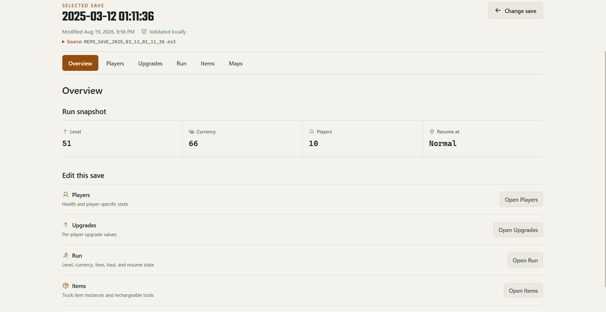
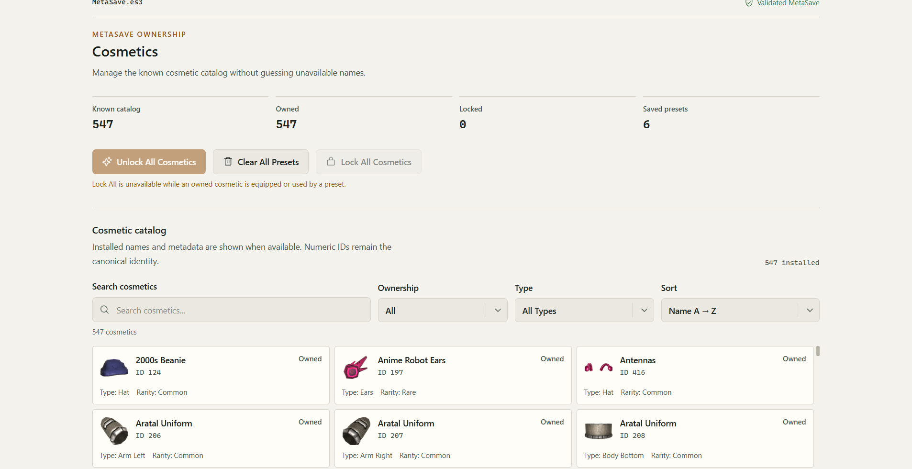
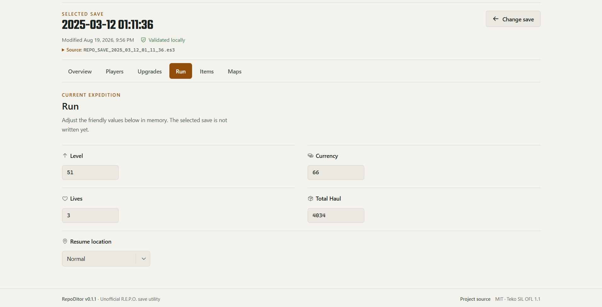
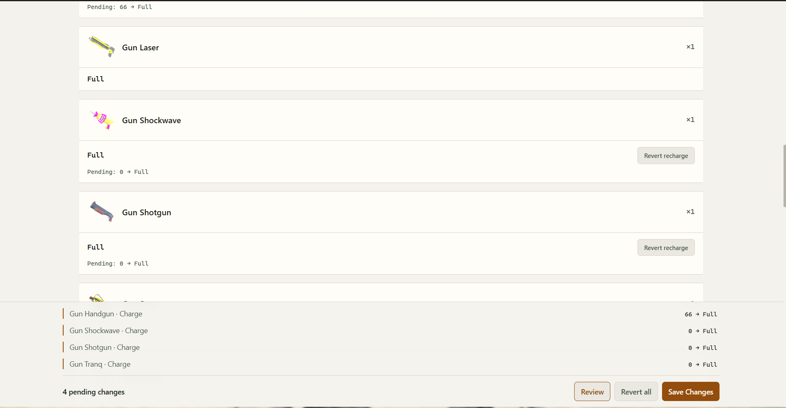
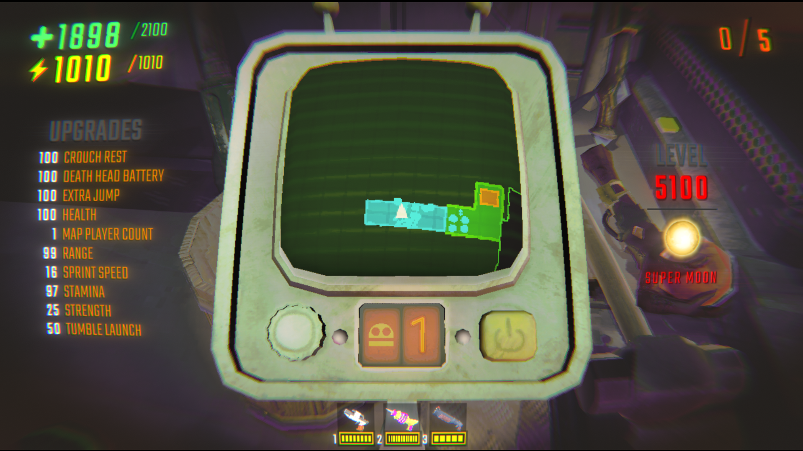

<p align="center">
  
  
  
  
  
  
  
</p>

<div align="center">

# RepoDitor

### Inspect and safely edit local R.E.P.O. saves from a focused Windows desktop app

RepoDitor is an unofficial Electron editor for local R.E.P.O. `.es3` data.
The interface uses narrow typed operations while a bundled Python backend owns
save parsing, validation, backups, game semantics, and encrypted writes.

<sub>Overview · Players · Upgrades · Run · Items · Cosmetics · Maps</sub>

[Download the latest release](https://github.com/Yoruxyv/RepoDitor/releases/latest)

</div>

---

> [!IMPORTANT]
> Close R.E.P.O. before opening or editing saves. RepoDitor is an unofficial
> community tool and is not affiliated with semiwork. Back up important data;
> game updates can change the save format or behavior.

## ✨ Features

### Run Saves

| Workspace | Current support |
|---|---|
| **Overview** | Review the selected run, its summary, and pending changes |
| **Players** | Edit current health, heal to the Python-calculated maximum, and show optional Steam avatars |
| **Upgrades** | Edit upgrades discovered dynamically from the save, with installed metadata and artwork enrichment when available |
| **Run** | Edit supported run values through typed, validated fields |
| **Items** | Search, filter, and sort discovered instances; stage **Refill to Full** only when installed metadata confirms the item type is rechargeable and that exact instance has stored charge |
| **Maps** | List locally installed maps without injecting code or forcing a map selection |

### Cosmetics / MetaSave

Cosmetics has its own workspace and safe-write lifecycle, independent from a
selected Run save. When compatible installed metadata is available, it shows
game-owned display names, types, rarity values, optional local icons,
ownership totals, and saved-preset count. The catalog supports search,
ownership/type filters, and sorting without using presentation metadata as
mutation authority.

The current actions are:

- Unlock one eligible locked cosmetic or **Unlock All Cosmetics**;
- **Lock All Cosmetics**, only when no known owned cosmetic is equipped,
  preset-referenced, or otherwise unsafe to remove;
- **Clear All Presets**, which clears the paired cosmetic/color preset slots.

Mutation eligibility remains limited to installed IDs within the independently
proven `0..546` boundary. Unknown and future cosmetic IDs are preserved
read-only. Token editing, arbitrary equipment/color editing, and arbitrary
preset creation/editing are not supported because their game semantics have
not been established safely.

## 🖼️ Preview

| Run overview | Cosmetics catalog |
|---|---|
|  |  |

| Run editor | Evidence-backed item refill |
|---|---|
|  |  |

### Manual in-game compatibility check



This maintainer-run check loaded a save edited through RepoDitor in R.E.P.O.
and displayed the resulting high level, upgrade, health, energy, and
charged-item values. It documents that tested save and game build; it is not a
compatibility or data-safety guarantee for every build.

## 🚀 Quick Start

### Requirements

- Windows x64
- a local R.E.P.O. installation and save

### Install

1. Open the [official GitHub Releases page](https://github.com/Yoruxyv/RepoDitor/releases/latest).
2. Download `RepoDitor-Setup-<version>-x64.exe` and its `.sha256` file.
3. Verify the checksum as described below, then run the assisted installer.

The installed app includes its Python backend. Python, Node.js, npm, and `uv`
are not required for normal use.

RepoDitor discovers `REPO_SAVE_*.es3` files below the current Windows account's
R.E.P.O. save directory. Files containing `BACKUP` are excluded from automatic
discovery.

Updates are manual; RepoDitor installs no updater or background service.
Uninstall through **Windows Settings → Apps → Installed apps → RepoDitor**.
Uninstalling does not delete R.E.P.O. saves or RepoDitor-created `.bak-*`
backups.

## 🛡️ Save Safety

R.E.P.O. can retain save state in memory and write it later. Editing while the
game is running could therefore use stale persisted data or be overwritten by
a later game save. Startup and window-focus checks keep the interface current;
the Python write boundary independently requires a confirmed-closed game both
before loading the source and again immediately before persistence. An unknown
process state fails closed.

The write pipeline is:

1. Edits remain in memory until **Save Changes** is confirmed.
2. Python loads and validates the current source, then compares its SHA-256 with
   the fingerprint captured when the save was opened.
3. Typed changes are validated and applied in memory, followed by the second
   game-process check.
4. The repository rereads the source, requires an exact-byte match, and creates
   a timestamped exact-byte backup beside it.
5. Encrypted output is staged, reopened, decrypted, validated, and compared
   with the intended data.
6. The source is checked once more before the staged file atomically replaces it.

These safeguards reduce risk; they are not a guarantee against future game
format changes or every form of data loss.

## ✅ Verifying a Windows Download

Windows SmartScreen may show **Unknown Publisher** or an unrecognized-app
warning for an unsigned or low-reputation build. Download only from RepoDitor's
official GitHub Releases page. The source and build workflows are public, and
published installers include a SHA-256 checksum file.

In PowerShell, place both files in the same directory and run:

```powershell
Get-FileHash .\RepoDitor-Setup-<version>-x64.exe -Algorithm SHA256
Get-Content .\RepoDitor-Setup-<version>-x64.exe.sha256
```

The hexadecimal hashes must match exactly, ignoring letter case. A matching
checksum confirms the file matches the published artifact; it does not by
itself establish publisher identity. Historical v0.1.0 installers were
unsigned. The current release workflow is prepared to require Microsoft cloud
signing for official tagged builds, but the repository cannot prove whether
maintainer-owned signing credentials have been configured.

## 🔐 Security Model

The renderer is sandboxed with `contextIsolation: true` and
`nodeIntegration: false`. It cannot read arbitrary files, spawn processes,
decrypt saves, invoke arbitrary IPC, or receive raw decrypted save JSON.

Steam avatar enrichment is optional and fail-soft. Only plausible Steam IDs
are queried, returned image URLs are validated against narrow HTTPS hosts, and
profile data is never written into a save. GitHub stars use one fixed metadata
endpoint through typed Electron IPC with a successful-result session cache;
the renderer receives no arbitrary network-fetch API.

Those are the current optional background network requests. Project links open
externally only after user action, and the current source contains no analytics
or telemetry integration.

See [SECURITY.md](SECURITY.md) to report a vulnerability privately.

## 🔎 Open Source & Local Data

RepoDitor is open source. The Electron desktop application, Python save
backend, packaging configuration, and CI/release workflows are available in
this repository for inspection, and the project can be built from source using
the documented development and packaging commands. Public source does not by
itself prove that a downloaded binary is identical to it; the published
checksum verifies artifact integrity, not code safety or publisher identity.

Save parsing, validation, and editing run locally in the bundled Python
backend. Raw decrypted save JSON stays behind the Python desktop boundary and
is neither exposed to React nor uploaded to a remote save-processing service.
The application reads the fixed R.E.P.O. save and MetaSave locations, Steam
installation metadata, supported installed-game data files, and R.E.P.O.'s
game-generated icon cache. It writes a save only after an explicit supported
save action, creates its backup and temporary staging file beside that source,
and stores renderer preferences plus derived presentation/catalog caches in
RepoDitor-owned application data.

Two optional features use narrowly scoped network requests: GitHub project
metadata is read from the fixed RepoDitor repository endpoint, and Steam avatar
enrichment sends a plausible save-derived Steam ID to the corresponding public
Steam profile endpoint before accepting only allowlisted HTTPS avatar hosts.
Neither request receives a save file or raw decrypted save data. Current
application source and dependencies contain no analytics, advertising SDK,
usage telemetry, crash-report upload, or remote logging integration.

## 💾 Save Freshness & Presentation Cache

Save authority and presentation caching are deliberately separate:

| Data | Current behavior |
|---|---|
| **Save state** | Every explicit open asks Python to read, decrypt, and validate the current `.es3`, then returns only typed projections and a source fingerprint. Decrypted save JSON is not persisted. The renderer may reuse typed editor-entry data during the current app session only after another open confirms the same fingerprint; a successful write invalidates that entry. |
| **Game-generated item/cosmetic icons** | PNGs remain in R.E.P.O.'s LocalLow icon cache. Electron serves validated files through opaque in-memory tokens; cache paths and filenames do not cross into React. |
| **Derived upgrade artwork** | Python resolves and decodes supported textures from the installed game. Electron stores validated derived PNGs under `%APPDATA%\repoditor-desktop\presentation`, reuses them only while watched source identities are unchanged, prunes unreferenced derived PNGs, and regenerates or falls back to Phosphor when an entry is missing, changed, malformed, or unreadable. |
| **Installed cosmetic metadata** | A derived catalog cache under `%LOCALAPPDATA%\RepoDitor\cache\cosmetics` is accepted only when its schema, Steam build, game root, and relevant installed-file identities still match. It provides presentation data, never ownership evidence or mutation authority. |

Theme and language preferences use renderer storage. RepoDitor writes R.E.P.O.
data only after an explicit supported save action; backups are created beside
the source rather than inside the presentation caches.

To audit the derived presentation cache after restarting RepoDitor, run:

```powershell
.\desktop\scripts\check-presentation-cache.ps1
```

The read-only script compares `manifest.json` with the stored hash-named PNGs
and reports unreferenced or missing artifacts.

## 🌐 Languages & Appearance

RepoDitor supports **Dark**, **Light**, and **System** themes. Theme and language
preferences are stored locally in the renderer, and System follows the Windows
appearance setting.

The RepoDitor-owned interface is available in:

- English
- Japanese (日本語)
- Korean (한국어)
- Chinese (中文)
- Indonesian (Bahasa Indonesia)

Game-owned strings—such as player names, item names, map names, and values read
from saves—remain unchanged. The interface also respects reduced-motion
preferences; its local interaction sound is decorative and not required to
understand application state.

## 🧠 How It Works

```text
React renderer
  ↓ typed feature calls
Sandboxed Electron preload
  ↓ narrow IPC contracts
Electron main process
  ↓ structured requests
Bundled Python desktop API
  ↓
Services → core/storage → encrypted .es3 data
```

Run saves and MetaSave use independent fingerprints, pending changes, backups,
and save sessions while reusing the same validated encrypted repository.
Python remains authoritative for game and save semantics.

Save and installed-content discovery is dynamic where the verified structure
supports it. Build-specific installed-game readers use explicit compatibility
gates; uncertainty degrades presentation or capability to unavailable/unknown
and does not expand mutation authority. See the
[architecture](docs/architecture/architecture.md) and
[reverse-engineering notes](docs/research/reverse-engineering.md) for the deeper boundary.

## 🧪 Quality & Testing

Automated tests use generated or sanitized fixtures and temporary copies, never
real user saves. The repository checks Python formatting/tests, renderer import
boundaries, lint, TypeScript builds, component/contract tests, Windows Electron
E2E, package contents, packaged E2E without Vite, and installer structure.

```powershell
uv run ruff check python tests
uv run ruff format --check python tests
uv run mypy
uv run --locked --no-dev --group test pytest

Set-Location desktop
npm run imports:check
npm run format:check
npm run lint
npm run release:check
npm run build
npm run bundle:check
npm test
npm run test:e2e
```

## 🛠️ Development

Development requires `uv`, Python 3.11 or newer, and Node.js 24.

```powershell
git clone https://github.com/Yoruxyv/RepoDitor.git
Set-Location RepoDitor
uv sync --locked

Set-Location desktop
npm ci
npm run dev
```

See [CONTRIBUTING.md](CONTRIBUTING.md) for architecture, evidence, privacy, and
pull-request expectations.

## 📦 Packaging & Releases

From `desktop/`, `npm run package` builds a locked Python 3.13 PyInstaller
**onedir** sidecar, the production Electron app, unpacked packaged smoke test,
assisted NSIS installer, and local artifact verification under
`desktop/release/`. Electron Builder installs the sidecar directory under
`resources/backend/` while retaining the fixed
`resources/backend/repoditor-backend.exe` entry point. This local path is
intentionally unsigned.

Official tagged GitHub releases use separate fail-closed signing commands,
verify Authenticode signatures before generating SHA-256 files, and publish only
after the existing package checks. A separate temporary manual workflow can
publish a prominently labeled unsigned release while signing approval or
credentials are unavailable; it retains the quality, package, packaged-E2E,
installer, and checksum gates but omits signature verification. See the
[release checklist](docs/release-checklist.md) for current requirements and the
preserved historical v0.1.0 baseline.

## ⚠️ Limitations

- RepoDitor targets observed R.E.P.O. encrypted-save structures; game updates
  may introduce incompatible data.
- Items supports only exact-instance **Refill to Full** after both installed
  item-type capability and stored-charge evidence agree. Numeric charge editing,
  battery-upgrade writes, purchase mutations, and item add/delete/duplicate
  remain disabled.
- Cosmetics supports eligible individual unlocks, bulk unlock, guarded bulk
  lock, and paired preset clearing. Equipment, token, arbitrary color, and
  arbitrary preset creation/editing remain unsupported; IDs outside the proven
  mutation boundary are preserved read-only.
- Maps is discovery-only; RepoDitor does not inject code or force map selection.
- Steam avatar enrichment can be unavailable for invalid, private, malformed,
  unreachable, or unsupported profiles without blocking Players.
- Item recharge capability and decoded upgrade artwork use compatibility gates
  for the validated installed-game layout. A game update can make those
  capabilities unknown or artwork unavailable while ordinary supported save
  reading remains available.
- RepoDitor currently targets Windows x64 and has no automatic updater.

## 📚 Documentation

| Document | Purpose |
|---|---|
| [Documentation index](docs/README.md) | Organized entry point for technical and release documentation |
| [Architecture](docs/architecture/architecture.md) | Desktop boundaries, ownership, and data flow |
| [Electron UI](docs/architecture/electron-ui.md) | Renderer identity, responsiveness, appearance, and accessibility |
| [Save format](docs/research/save-format.md) | Confirmed encrypted-save structure |
| [Reverse engineering](docs/research/reverse-engineering.md) | Historical evidence, current support, and unresolved semantics |
| [Release checklist](docs/release-checklist.md) | Current release gates and historical v0.1.0 baseline |
| [Asset research](docs/research/asset-research.md) | Local asset-discovery evidence and redistribution boundary |
| [Third-party notices](THIRD_PARTY_NOTICES.md) | Bundled asset and dependency attribution |

## 🤝 Contributing

Focused bug reports, feature proposals, documentation improvements, and pull
requests are welcome. Use the repository templates and never publish real save
files, backups, Steam identifiers, usernames, or local filesystem paths.

Read [CONTRIBUTING.md](CONTRIBUTING.md), [SECURITY.md](SECURITY.md), and the
[Code of Conduct](CODE_OF_CONDUCT.md) before contributing.

## 👤 Maintainer

<table>
  <tr>
    <td align="center" width="180">
      <a href="https://github.com/Yoruxyv">
        <br>
        <b>Hans</b>
      </a>
    </td>
  </tr>
</table>

## 📄 License

RepoDitor is released under the [MIT License](LICENSE). R.E.P.O. and related
names are trademarks or property of their respective owners. RepoDitor is an
unofficial save-management utility and does not redistribute R.E.P.O. game
assets.
